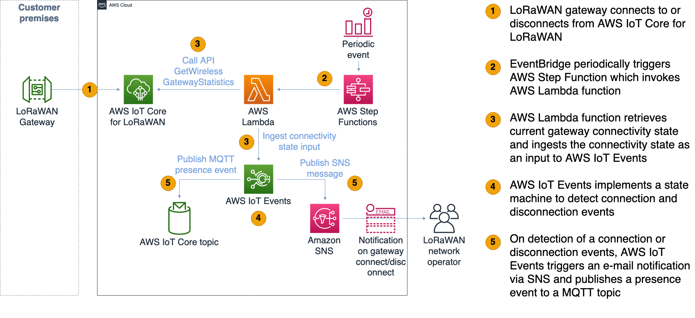
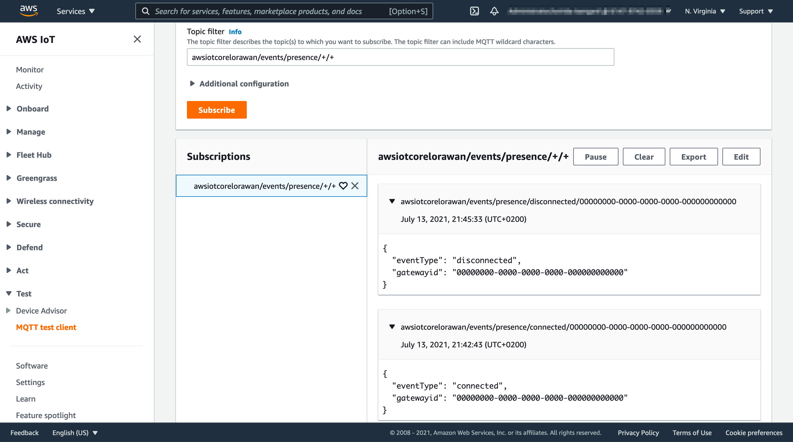

# Monitoring and notifications for LoRaWAN gateway connection status

This sample contains an example solution for monitoring connectivity status, i.e. connections and disconnections for LoRaWAN gateways using AWS IoT Core for LoRaWAN. Disconnection detection will consider a configurable grace period (default is 5 minutes). After deploying this solution in your AWS account, you will receive an e-mail notificiation each time your LoRaWAN gateway connects or disconnects.  Additionaly, a message will be published to AWS IoT Core message broker MQTT topic (e.g. `awsiotcorelorawan/events/presence/disconnect/<WirelessGatewayId>`) each time the gateway connects and disconnects.

Please consider the following definition of "connect" and "disconnect" as used in this sample:

- A "connect" refers to a LoRaWAN gateway which successfully reestablishes a new connection, or a gateway successfully connected first time to AWS IoT Core for LoRaWAN.
- A "disconnect" refers to a LoRaWAN gateway which is disconnected from AWS IoT Core for LoRaWAN for longer then a grace period (configurable, default is 1 minute). The grace periods is intended to filter out short (e.g. < 1 min) disconnections not impacting the IoT application.

## Solution architecture



## Costs

Please note that starting this solution will result in continious additional charges to your AWS account for usage of services such as AWS Step Functions, AWS Lambda , AWS IoT Events and Amazon CloudWatch. For example, the AWS Step Functions state machine will invoke the AWS Lambda every 4 minutes (configurable). Please ensure to follow [these guidelines](#5-stop-the-execution-of-the-solution) stop the execution of the AWS Step Functions state machine and remove the stack to stop incurring costs for this solution.

## Quick deployment

Please run the following commands in your local shell or in AWS CloudShell.

### **1. Deploy the CDK stack**

``` shell
# Clone the repository 
git clone https://github.com/aws-samples/aws-iot-core-lorawan
cd aws-iot-core-lorawan/gateway_watchdog
# Set up and activate virtual environment
python3 -m venv .env
source .env/bin/activate 
# Install AWS CDK and neccessary CDK libraries
npm install -g aws-cdk
pip3 install -r requirements.txt   
# If first time running CDK deployment in this account / region, run CDK bootstap
# This is a one-time activity per account/region, e.g. 
# cdk bootstrap aws://123456789/us-east-1
cdk bootstrap aws://<Account Id>/<Region name>
# Deploy the stack. Ensure to replace <E-Mail> with the E-Mail adresss to send notifications to
cdk deploy --parameters emailforalarms=<E-Mail>
```

### **2. Confirm the SNS e-mail subscription**  

Please check your mailbox for an e-mail message with subject "AWS Notification - Subscription Confirmation" and confirm the subscription.

### **3. Start the AWS step functions state machine** 

As an output of the stack, you will receive a command to start the AWS state machine execution, e.g.

```shell 
...
Outputs:
LorawanConnectivityWatchdogStack.StateMachineStartCommand = aws stepfunctions start-execution --state-machine-arn arn:aws:states:us-east-1:614797420359:stateMachine:LoRaWANGatewayWatchdogStatemachine67D21B94-Ngdhwg91Keqq
```

The state machine will periodically invoke the AWS Lambda function to read the gateway connectivity status and ingest it to AWS IoT events input. Please run the previously shown command to start the state machine execution , e.g. :

```shell
aws stepfunctions start-execution --state-machine-arn arn:aws:states:us-east-1:614797420359:stateMachine:LoRaWANGatewayWatchdogStatemachine67D21B94-Ngdhwg91Keqq

{
    "executionArn": "arn:aws:states:us-east-1:614797420359:execution:LoRaWANGatewayWatchdogStatemachine67D21B94-Ngdhwg91Keqq:4c92e301-8525-4961-80a1-26768d9da294",
    "startDate": "2021-07-13T21:18:14.426000+02:00"
}
```
    
### **4. View notifications and MQTT presence events** 

For a test purpose, disconnect your LoRaWAN gatway from AWS IoT Core for LoRaWAN. Watch out for mails with notification about connects and disconnects. You can also open the [MQTT Test client](https://console.aws.amazon.com/iot/home?region=#/test) and subscribe to the topic pattern `awsiotcorelorawan/events/presence/+/+` to see the published presence events, e.g.:


### **5. Stop the execution of the solution** 

As an output of the stack, you have receiveed a command to start the AWS state machine execution, e.g.

```shell 
...
Outputs:
LorawanConnectivityWatchdogStack.StateMachineStartCommand = aws stepfunctions stop-execution --state-machine-arn arn:aws:states:us-east-1:614797420359:stateMachine:LoRaWANGatewayWatchdogStatemachine67D21B94-Ngdhwg91Keqq
```

Please run this command to stop a periodic execution of the Lambda function.

### **6.Remove the stack**

``` 
cd cd aws-iot-core-lorawan/lorawan_connectivity_watchdog
cdk destroy
```


## Troubleshooting

### View AWS Step Functions execution trace

1. Open state machine `LoRaWANGatewayWatchdogStatemachine...` [here](https://console.aws.amazon.com/states/home?region=#/statemachines)
2. Click on a recent exeuction
3. View the execution trace and potential errors

### View AWS IoT Events logs

1. Open AWS IoT Events settings [here](https://console.aws.amazon.com/iotevents/home?region=#/settings/logging)
2. Configure Logging on "DEBUG" level with a debug target as detector model `LoRaWANGatewayConnectivityModel`
3. View the CloudWatch logs for potentially helpful error messages from AWS IoT Events

## Implementation setails

### **AWS IoT Events**
AWS IoT Events Detector model:


### **AWS Step functions state machine**


## Local testing


### Install SAM CDK (beta)
```
brew install aws-sam-cli-beta-cdk.
```

### Locally invoke AWS Lambda

```
sam-beta-cdk local invoke LorawanConnectivityWatchdogStack/GetWirelessGatewayStatisticsLambda -e tests/input_connected.json
```

```
sam-beta-cdk local invoke LorawanConnectivityWatchdogStack/GetWirelessGatewayStatisticsLambda -e tests/input_disconnected.json
```