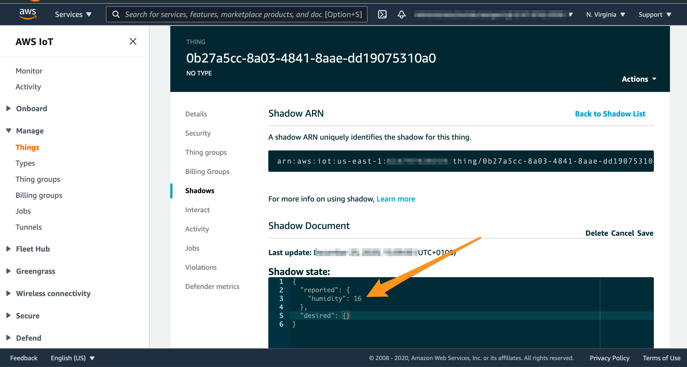

# AWS IoT Core for LoRaWAN: how to update IoT Thing shadow with decoded device payload 
## Introduction
The [AWS IoT Device Shadow service](https://docs.aws.amazon.com/iot/latest/developerguide/iot-device-shadows.html) adds shadows to AWS IoT thing objects. Shadows can make a device’s state available to apps and other services whether the device is connected to AWS IoT or not. AWS IoT thing objects can have multiple named shadows so that your IoT solution has more options for connecting your devices to other apps and services. 

This sample contains examples on how you can update a [named shadow of an AWS IoT Thing](https://aws.amazon.com/about-aws/whats-new/2020/07/aws-iot-core-now-supports-multiple-shadows-for-a-single-iot-device/) with decoded LoRaWAN device telemetry. 

For the sake of explanation, let's assume your LoRaWAN device with a WirelessDeviceId `0b27a5cc-8a03-4841-8aae-dd19075310a0` sends a binary payload `0x1020` indicating the currently measured humidity and temperature level. This sample contains examples on how you can update a shadow of an AWS IoT Thing with decoded payload (e.g. `{"humidity" : 16, "temperature":32}`). For the shadow update, you can either use the same Thing name as WirelessDeviceId (i.e. `0b27a5cc-8a03-4841-8aae-dd19075310a0`), or implement custom logic for detecting a Thing Name for a shadow update.

In the example in the following figure, a shadow of the AWS IoT Thing with the name `0b27a5cc-8a03-4841-8aae-dd19075310a0` was updated with telemetry data from a LoRaWAN device:




## Before you start
Please consider following preconditions to use this sample:

- For a full functionality in this sample, a Fleet Indexing service should be enabled in your AWS account and selected region.  Please refer to [this blog](https://aws.amazon.com/blogs/iot/use-aws-iot-device-management-fleet-indexing-to-identify-and-visualize-fleet-state/) to learn about Fleet Indexing and to the [developer guide](https://docs.aws.amazon.com/iot/latest/developerguide/iot-indexing.html) for instructions on how to enable it.
- This sample is using a binary decoding approach as described in [AWS IoT Core for LoRaWAN - transform a binary LoRaWAN payload into JSON](https://github.com/aws-samples/aws-iot-core-lorawan/tree/main/iotthingshadow). If not done yet, please consider reviewing [AWS IoT Core for LoRaWAN - transform a binary LoRaWAN payload into JSON](https://github.com/aws-samples/aws-iot-core-lorawan/tree/main/iotthingshadow) before proceeding with this sample.

## Ressources in this sample

This sample implements two AWS IoT Rules: "..._UpdateShadowWithLoRaWANPayload_..." and "..._UpdateShadowWithLoRaWANPayload_MapThingName...".

Both rules will first decode a binary payload from a LoRaWAN device (e.g. `0x10`) into JSON (e.g.  `{"humidity" : 16}`) using an AWS Lambda function. After that both rules will update the shadow of an AWS IoT Thing with decoded values. However both rules differ in a way they define a name of AWS IoT Thing to update:

- IoT rule  **"..._UpdateShadowWithLoRaWANPayload_..."** updates the shadow of the IoT Thing `0b27a5cc-8a03-4841-8aae-dd19075310a0` (i.e. using value WirelessDeviceId as a Thing Name). The usage of this rule is recommended if you enable "Associate a thing with your wireless device" option when registering a new LoRaWAN devices in AWS IoT Core for LoRaWAN console.
- IoT Rule **"..._UpdateShadowWithLoRaWANPayload_MapThingName..."** demonstrates how you can build a custom logic to define the name of IoT Thing to update the shadow by implementing an AWS Lambda function. This provides more flexibility in choice of names of AWS IoT Things. An example Lambda function in this sample will select a Thing by performing a lookup in the IoT Registry based on the Thing attribute `WirelessDeviceId`.

In addition to both AWS IoT Rules, the SAM template in this sample will also deploy the following resources:
- AWS Lambda function `<stack name>-MapThingNameFunction...` 
- AWS Lambda function `<stack name>-TransformBinaryPayloadFunction...` 
- AWS Lambda layer `<stack name>-LoRaWANPayloadDecoderLayer...`
- AWS IAM roles with permissions for AWS Lambda functions


## Step 1: deploy AWS CloudFormation stack

Please follow the steps below :

1. Check out this repository on your computer

    ```shell
    git clone https://github.com/aws-samples/aws-iot-core-lorawan 
    cd aws-iot-core-lorawan/iotthingshadow
    ```

2. This sample uses AWS SAM to build and deploy all necessary resources. Please perform the following commands to build the SAM artifacts:

   ```shell
   sam build
   ```

   Please remember to run `sam build` after each change change in your code or templates.

3. Deploy the SAM template to your AWS account.

   ```shell
   sam deploy --guided --stack-name thingshadow
   ```

    Please note that `sam deploy --guided --stack-name thingshadow` should be only executed for a first deployment. To redeploy after that please use `sam deploy`. If you choose a different stack name then `thingshadow`, please ensure to adjust the prefix of AWS IoT Rule names accordingly.


## Step 2: test shadow update using AWS IoT Rule **"..._UpdateShadowWithLoRaWANPayload_..."** 

1. Please open an [AWS IoT MQTT Test Client](https://docs.aws.amazon.com/console/iot/view-mqtt-messages)

2. Please subscribe to the MQTT topic `$aws/things/11111111-1111-1111-1111-1111/shadow/name/LoRaWANData/update`

3. Please publish the payload below to the MQTT topic `$aws/rules/thingshadow_UpdateShadowWithLoRaWANPayload_sample_device`. By doing so you will invoke the AWS IoT Rule  `thingshadow_UpdateShadowWithLoRaWANPayload_sample_device`. The payload is structured in a same way it will be ingested by AWS IoT Core for LoRaWAN:

```json
{
    "PayloadData": "y7QKRAGpAQnEf/8=",
    "WirelessDeviceId": "11111111-1111-1111-1111-1111",
    "WirelessMetadata": {
      "LoRaWAN": {
        "DataRate": 0,
        "DevEui": "a84041d55182720b",
        "FPort": 2,
        "Frequency": 867900000,
        "Gateways": [
          {
            "GatewayEui": "dca632fffe45b3c0",
            "Rssi": -76,
            "Snr": 9.75
          }
        ],
        "Timestamp": "2020-12-07T14:41:48Z"
      }
    } 
}
```

4. Please verify that the following message arrives at the topic `$aws/things/11111111-1111-1111-1111-1111/shadow/name/LoRaWANData/update`

```json
{
  "state": {
    "reported": {
      "temperature": 11.28,
      "humidity": 45.11,
      "status": 200
    }
  }
}
```

The payload above was generated by an example binary decoder based on binary Base64-encoded payload `y7QKRAGpAQnEf/8=` . You can review the source code of the example binary decoder in [src-payload-decoders/python/sample_device.py](src-payload-decoders/python/sample_device.py) and use [these guidelines](#how-to-build-a-binary-decoder-for-your-lorawan-device) to build a binary decoder for your device.

  
## Step 3: Integrating with AWS IoT Core for LoRaWAN

After a successful deployment of the AWS CloudFormation stack, you can configure AWS IoT Core for LoRaWAN to invoke AWS IoT Rule **"..._UpdateShadowWithLoRaWANPayload_..."**  each time your LoRaWAN device is sending payload:

1. Open "IoT Core" in an AWS management console
2. Click on "Wireless connectivity"
3. Click on "Destinations"
4. Click on "Add destination"
5. Configure the new destination:
   - IAM Role : if you have not created the IAM role for invocation of AWS IoT Rule yet, please click [here for guidelines](#how-to-build-a-binary-decoder-for-your-lorawan-device)
   - DestinationName: for example `SampleDeviceDestination`
   - RuleName: please input `thingshadow_UpdateShadowWithLoRaWANPayload_sample_device`

6. Click on "Add destination" button at the bottom of the page
7. Please assign the newly created destination `SampleDeviceDestination` to a LoRaWAN device:  
     - If you create a new LoRaWAN device in AWS IoT Core for LoRaWAN, you should specify `SampleDeviceDestination` as a destination
     - If you already have created a LoRaWAN devices, please use the "Edit" function of the console to update the Destination of the device

## Step 4: Verify the invocation of the AWS IoT Rule on ingestion from a LoRaWAN device

The following description assumes that you already added your LoRaWAN Device in AWS IoT Core for LoRaWAN. To learn how to do that, please consult [AWS IoT Core for LoRaWAN developer guide](https://docs.aws.amazon.com/iot/latest/developerguide/connect-iot-lorawan.html#connect-iot-lorawan-getting-started-overview).

1. Please open an [AWS IoT MQTT Test Client](https://docs.aws.amazon.com/console/iot/view-mqtt-messages)

2. Please subscribe to the MQTT topic `$aws/things/<Replace with your WirelessDeviceId>/shadow/name/LoRaWANData/update`

3. On your console, please invoke AWS CLI:
      
    ```shell
    aws iotwireless test-wireless-device --id <Replace with your WirelessDeviceId>
    ```
    The expected output is: 
    ```shell
    {
    "Result": "test succeed. one message is sent with payload: hello"
    }
    ```

4. Please verify that the following message arrives at the topic `$aws/things/<Replace with your WirelessDeviceId>/shadow/name/LoRaWANData/update`

    ```json
    {
      "state": {
        "reported": {
          "temperature": 11.28,
          "humidity": 45.11,
          "status": 200
        }
      }
    }
    ```

Congratulations! You have learned how to update a [named shadow of an AWS IoT Thing](https://aws.amazon.com/about-aws/whats-new/2020/07/aws-iot-core-now-supports-multiple-shadows-for-a-single-iot-device/) with decoded LoRaWAN device telemetry.

Please consider section [How to build transformation routine for your LoRaWAN device ](#how-to-build-a-binary-decoder-for-your-lorawan-device) for guidelines on building a decoder for your LoRaWAN device.

## Step 5: Cleaning up

Please open AWS CloudFormation console, select the stack and click on "Delete"

## How to build a binary decoder for your LoRaWAN device 

### Prerequisites

- Install the AWS CLI
- Install the AWS SAM CLI

### Implementation steps

Please perform following steps to implement your own binary transformation model:

1. Check out this repository on your computer

    ```shell
    git clone https://github.com/aws-samples/aws-iot-core-lorawan 
    cd aws-iot-core-lorawan/iotthingshadow
    ```

2. Review source code of binary transformation for example in [src-payload-decoders/python/sample_device.py](src-payload-decoders/python/sample_device.py). Create a copy of the example, e.g.

  ```
  cp src-payload-decoders/sample_device.py src-payload-decoders/python/myydevice.py
  ```
 
3. Implement decoding logic in `src-payload-decoders/python/mydevice.py`
 
4. Modify `src-iotrule-transformation/app.py` by 
    - Adding `import mydevice.py` 
    - Adding "mydevice" value to VALID_PAYLOAD_DECODER_NAMES

5. This sample uses AWS SAM to build and deploy all necessary resources (e.g. AWS Lambda function, AWS IoT Rule, AWS IAM Roles) to your AWS account. Please perform the following commands to build the SAM artifacts:

   ```shell
   sam build
   ```

   As a result, the artifacts for the deployment will be placed in a an `.aws-sam` directory.

6. Deploy the SAM template to your AWS account.

   ```shell
   sam deploy --guided --stack-name 
   ```

    Please note that `sam deploy --guided` should be only executed for a first deployment. To redeploy after that please use `sam deploy`.

    Congratulations! You successfully deployed your binary transformation logic into your AWS account. Please follow [this guidelines](#step-3-integrating-with-aws-iot-core-for-lorawan) to integrate with AWS IoT Core for LoRaWAN

## How to create an IAM role for AWS IoT Core for LoRaWAN destination

Please use AWS IAM to add an IAM role with the following configuration:

**Trust relationship**  

```json
{
  "Version": "2012-10-17",
  "Statement": [
    {
      "Effect": "Allow",
      "Principal": {
        "Service": [
          "iotwireless.amazonaws.com"
        ]
      },
      "Action": "sts:AssumeRole"
    }
  ]
}
```

**Permissions**  
Role permissions will depend on your use-cases, however they should at least contain the permission to publish to an IoT topic:

```json
{
    "Version": "2012-10-17",
    "Statement": [
        {
            "Sid": "VisualEditor0",
            "Effect": "Allow",
            "Action": [
                "iot:Publish"
            ],
            "Resource": [
                "arn:aws:iot:us-east-1:<your account id>:topic/*"
            ]
        }
    ]
}
```

Please adjust the policy according to your use case following a least privilege principle.