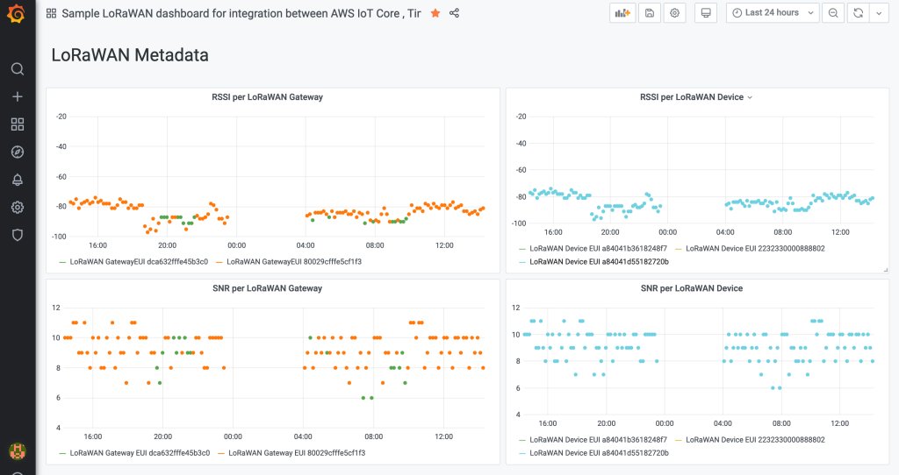
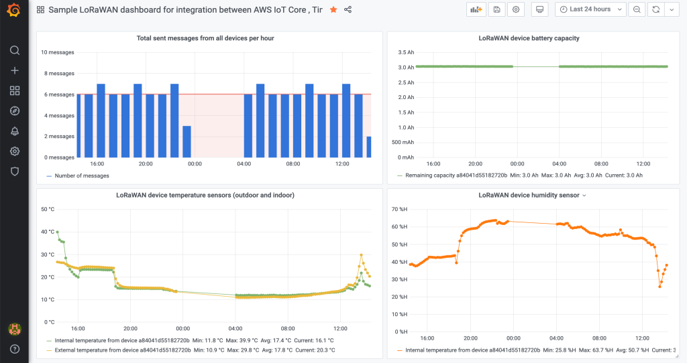

# How to analyse LoRaWAN payloads with Amazon Timestream and visualize them with Grafana

You can use "AWS IoT Core for LoRaWAN" to ingest time series data from your LoRaWAN devices into Amazon Timestream. After that you can visualize your data in Grafana using a [Grafana timestream plugin](https://grafana.com/grafana/plugins/grafana-timestream-datasource/installation). Below you will see an example for visualization of both LoRaWAN metadata (RSSI, SNR) as well as LoRaWAN device sensor telemetry (temperature, humidity):



**Example of LoRaWAN device sensor telemetry visualization:**  



This repository contains the resources needed to setup and test data ingestion to Amazon Timestream and implement visualizations using Amazon Timestream Grafana adapter.

The [SAM template](template.yaml) will create the following resources in your AWS account:

1. A Timestream database with a name __LoRaWANDatabase__ and tables with names __LoRaWANTelemetryTable__ and __LoRaWANMetadataTable__:
   - __LoRaWANTelemetryTable__ will store the decoded telemetry payload from LoRaWAN devices
   - __LoRaWANMetadataTable__ will store LoRaWAN metadata (e.g. RSSI and SNR per LoRaWAN gateway) for each ingestion

2. AWS IoT Rule __lorawan2timestream_WriteLoRaWANDataToTimestream_sample_device__ and related IAM Roles and Policies. The IoT Rule will use following topics as default:
    - lorawanbinary : pattern for subscription to incoming LoRaWAN messages
    - lorawanerror: Name of MQTT topic for to publish IoT Rule action error messages
    - debug: Name of MQTT topic to publish debugging information 

3. AWS Lambda function [__WriteLoRaWANDataToTimestreamFunction__](src-lambda-write-to-timestream/app.py) and related IAM Roles and Policies. This function write the decoded payload attributes as measures into the Timestream table __LoRaWANTelemetryTable__. Additionally this function will write LoRaWAN metadata (e.g. RSSI and SNR per LoRaWAN gateway) into the Timestream table __LoRaWANMetadataTable__. To load payload decoders, this function will include AWS Lambda layer __LoRaWANPayloadDecoderLayer__.

Please note: the CloudFormation stack in this sample prepends a stack name to the name of the above mentioned resources. For example if you use the **lorawan2timestream** as a stack name, the name of Timestream database will be **lorawan2timestreamLoRaWANDatabase** and the name of AWS IoT Rule  will be **lorawan2timestream_StoreLoRaWANDataInTimestream**.

## Prerequisites

If you want to use this sample by simulating ingestion from a LoRaWAN device (e.g. if you don't have a LoRaWAN device yet), please jump directly to the next section [Setup](#setup). 

If you want to ingest telemetry from your LoRaWN device, please ensure that the following prerequisites are met:

**1. Your LoRaWAN devices and gateways are connected to AWS IoT Core for LoRaWAN**   
The instructions in this sample assume that you already have connected LoRaWAN devices and LoRaWAN gateways to LoRaWAN for IoT Core according to the [documentation](TBD). However, this sample also contains guidelines on how to test the functionality by simulating ingestion from a LoRaWAN device.

**2. You have implemented a binary decoder for your LoRaWAN device**  

You can learn how to build a binary decoding logic for your LoRaWAN device by following guidelines in [this section](#how-to-build-a-binary-decoder-for-your-lorawan-device)


## Setup


### Step 1: Launch the AWS CloudFormation stack
```
sam build 
sam deploy --guided --stack-name timestreamdemo
```


### Step 2: Simulate ingestion from a LoRaWAN device 
In this step we will test the successful deployment of the stack by simulating an ingestion from a LoRaWAN device. You can also use this step to test the sample if you have not connected your LoRaWAN devices and gateways to AWS IoT Core yet.

To simulate an ingestion from a LoRaWAN device, please use an [AWS IoT MQTT Test Client](https://docs.aws.amazon.com/iot/latest/developerguide/view-mqtt-messages.html) by publishing a following payload to the topic `$aws/rules/timestreamdemo_WriteLoRaWANDataToTimestream_YOURDECODERNAME`:

```json
{
    "WirelessDeviceId": "904d63b1-ed1d-42ad-8cb4-6778dd03e86c",
    "WirelessMetadata": {
      "LoRaWAN": {
        "DataRate": 0,
        "DevEui": "a84041d55182720b",
        "FPort": 2,
        "Frequency": 867300000,
        "Gateways": [
          {
            "GatewayEui": "dca632fffe45b3c0",
            "Rssi": -69,
            "Snr": 10
          },
          {
            "GatewayEui": "aca632fffe45b3c0",
            "Rssi": -9,
            "Snr": 15
          }
        ],
        "Timestamp": "2020-12-09T16:39:29Z"
      }
    },
    "PayloadData": "y60JKwGJAQmrf/8="
  }
}
```

According to the query statement of the AWS IoT Rule __lorawan2timestream_WriteLoRaWANDataToTimestream_sample_device__, the AWS Lambda function __TransformLoRaWANBinaryPayloadFunction__  to a perform a binary decoding of the data stored in the "PayloadData" attribute. After performing binary decoding, the AWS IoT Rule will invoke  AWS Lambda function __WriteLoRaWANDataToTimestreamFunction__, providing decoded payload as an input. The __WriteLoRaWANDataToTimestreamFunction__ function will write the decoded payload to the Amazon Timestream tables __LoRaWANTelemetryTable__ and __LoRaWANMetadataTable__.


## Step 3: Query the Amazon Timestream tables

Please run a following command in your shell to query the data for a Timestream table __lorawan2timestreamLoRaWANMetadataTable__

```shell
aws timestream-query query --query-string "SELECT time,DevEui, measure_value::double AS SNR FROM lorawan2timestreamLoRaWANDatabase.lorawan2timestreamLoRaWANMetadataTable WHERE measure_name='SNR' ORDER BY time DESC LIMIT 1"
```

Please verify the expected output:

```json
{
    "Rows": [
        {
            "Data": [
                {
                    "ScalarValue": "2020-11-27 11:54:21.917000000"
                },
                {
                    "ScalarValue": "a84041b3618248f7"
                },
                {
                    "ScalarValue": "11.75"
                }
            ]
        }
    ],
    "ColumnInfo": [
        {
            "Name": "time",
            "Type": {
                "ScalarType": "TIMESTAMP"
            }
        },
        {
            "Name": "DevEUI",
            "Type": {
                "ScalarType": "VARCHAR"
            }
        },
        {
            "Name": "SNR",
            "Type": {
                "ScalarType": "DOUBLE"
            }
        }
    ],
    "QueryId": "AEDACAMYSGBKWN4IA7PQGNNW7RN4YVTSEU3AEM6Q47XDRYM7EA26XNMRV5YTKWA"
}
```

You can also use the [Amazon Timestream console](https://console.aws.amazon.com/timestream) to query tables __LoRaWANTelemetryTable__ and __LoRaWANMetadataTable__.
### Step 3: Integrating with AWS IoT Core for LoRaWAN

After a successful deployment of the AWS CloudFormation stack, you should configure AWS IoT Core for LoRaWAN to invoke AWS IoT Rule `lorawan2timestream_WriteLoRaWANDataToTimestream_sample_device` each time a LoRaWAN device is sending payload:

1. Open "IoT Core" in an AWS management console
2. Click on "Wireless connectivity"
3. Click on "Destinations"
4. Click on "Add destination"
5. Configure the new destination:
   - IAM Role : if you have not created the IAM role for invocation of AWS IoT Rule yet, please click [here for guidelines](#how-to-create-an-iam-role-for-aws-iot-core-for-lorawan-destination)
   - DestinationName: for example `SampleDeviceDestination`
   - RuleName: please input `lorawan2timestream_WriteLoRaWANDataToTimestream_sample_device`

6. Click on "Add destination" button at the bottom of the page
7. Please assign the newly created destination `SampleDeviceDestination` to a LoRaWAN device:  
     - If you create a new LoRaWAN device in AWS IoT Core for LoRaWAN, you should specify `SampleDeviceDestination` as a destination
     - If you already have created a LoRaWAN devices, please use the "Edit" function of the console to update the Destination of the device


### Step 4. Verify the ingestion of time series data into Amazon Timestream. 

Congratulations, you successfully prepared everything necessary to ingest time series data from your LoRaWAN devices connected to AWS IoT Core into Amazon Timestream. 

After each ingestion from a LoRaWAN device, you should be able to retrieve respective measurement values from Amazon Timestream tables __LoRaWANTelemetryTable__ and  __LoRaWANMetadataTable__ as in examples below:


### 6. Optional: visualize data using Grafana

You can use [Amazon Timestream plugin for Grafana](https://grafana.com/grafana/plugins/grafana-timestream-datasource/installation) to visualize LoRaWAN metadata by using the queries described before. Please take a look to an example of visualization:


Below you will find a sample queries to use in Grafana with [Amazon Timestream plugin for Grafana](https://grafana.com/grafana/plugins/grafana-timestream-datasource/installation) to implement the following:
- RSSI per gateway
- Total received messages
- Humidity


**Visualize RSSI per gateway**  

Please set the following macros in Grafana:
```
$__database = lorawan2timestreamLoRaWANDatabase
$__table = lorawan2timestreamLoRaWANMetadataTable
$__measure = Rssi
```

Please use the following query:

```sql
SELECT GatewayEui , CREATE_TIME_SERIES(time, measure_value::double) 
AS "LoRaWAN GatewayEUI"  
FROM $__database.$__table 
WHERE measure_name = 'Rssi' 
GROUP BY GatewayEui
```

Below you can see an example of Grafana configuration for these parameters:  


**Visualize total number of received messages per minute**

Please set the following macros in Grafana:

```
$__database = lorawan2timestreamLoRaWANDatabase
$__table = lorawan2timestreamLoRaWANTelemetryTable
$__measure = temperature
```
Please use the following query:

```sql
SELECT BIN(time, 1m), count(*) 
AS "Number of received messages" 
FROM $__database.$__table 
WHERE measure_name = '$__measure'  
GROUP BY BIN(time, 1m) 
ORDER BY BIN(time, 1m)
```

**Visualize humidity**

Please set the following macros in Grafana:

```
$__database = lorawan2timestreamLoRaWANDatabase
$__table = lorawan2timestreamLoRaWANTelemetryTable
$__measure = humidity
```
Please use the following query:

```sql
SELECT DevEui, CREATE_TIME_SERIES(time, measure_value::double) 
       FROM  $__database.$__table 
       WHERE measure_name = '$__measure'
       GROUP BY DevEui
```

## How to build a binary decoder for your LoRaWAN device 

### Preconditions

[AWS SAM CLI](https://docs.aws.amazon.com/serverless-application-model/latest/developerguide/serverless-sam-cli-install.html) shall be installed on your workstation. You can verify it by calling `sam --version`:

    ``` shell
    $ sam --version
    SAM CLI, version 0.53.0
    ```

### Implementation steps

Please perform following steps to implement your own binary transformation model:

1. Check out this repository on your computer

    ```shell
    git clone https://github.com/aws-samples/aws-iot-core-lorawan 
    cd aws-iot-core-lorawan/transform_binary_payload
    ```

2. Review source code of binary transformation for example in [src-payload-decoders/python/sample_device.py](src-payload-decoders/python/sample_device.py). Create a copy of the example, e.g.

    ```
    cp src-payload-decoders/sample_device.py src-payload-decoders/python/myydevice.py
    ```
    
3. Implement decoding logic in `src-payload-decoders/python/mydevice.py`
 
4. Modify `src-iotrule-transformation/app.py` by 
    - Adding `import mydevice.py` 
    - Adding "mydevice" value to VALID_PAYLOAD_DECODER_NAMES

5. This sample uses AWS SAM to build and deploy all necessary resources (e.g. AWS Lambda function, AWS IoT Rule, AWS IAM Roles) to your AWS account. Please perform the following commands to build the SAM artifacts:

   ```shell
   sam build
   ```

   As a results, the artifacts for the deployment will be placed in a an `.aws-sam` directory.

6. Deploy the SAM template to your AWS account.

   ```shell
   sam deploy --guided
   ```

    Please note that `sam deploy --guided` should be only executed for a first deployment. To redeploy after that please use `sam deploy`.

7. Update name of a binary decoder in your AWS IoT Rule

    Please modify the SQL query of your AWS IoT Rule and replace `"PayloadDecoderName": "sample_device"` with "PayloadDecoderName": "mydevice".

Congratulations! You successfully deployed your binary transformation logic into your AWS account. Please follow [this guidelines](#step-3-integrating-with-aws-iot-core-for-lorawan) to integrate with AWS IoT Core for LoRaWAN
### Troubleshooting

To monitor AWS IoT activity you should [enable logging](https://docs.aws.amazon.com/iot/latest/developerguide/configure-logging.html).

In case something doesn't work as expected try to use [Amazon CloudWatch insights](https://console.aws.amazon.com/cloudwatch/home?region=us-east-1#logsV2:logs-insights):

* Log group: `AWSIoTLogsV2`
* Filter

fields @timestamp, @message
| sort @timestamp desc
| limit 20
| filter ruleName = "lorawan2timestream_StoreLoRaWANDataInTimestream"


## How to create an IAM role for AWS IoT Core for LoRaWAN destination

Please use AWS IAM to add an IAM role with the following configuration:

**Trust relationship**  

```json
{
  "Version": "2012-10-17",
  "Statement": [
    {
      "Effect": "Allow",
      "Principal": {
        "Service": [
          "iotwireless.amazonaws.com"
        ]
      },
      "Action": "sts:AssumeRole"
    }
  ]
}
```

**Permissions**  
Role permissions will depend on your use-cases, however they should at least contain the permission to publish to an IoT topic:

```json
{
    "Version": "2012-10-17",
    "Statement": [
        {
            "Sid": "VisualEditor0",
            "Effect": "Allow",
            "Action": [
                "iot:Publish"
            ],
            "Resource": [
                "arn:aws:iot:us-east-1:<your account id>:topic/*"
            ]
        }
    ]
}
```

Please adjust the policy according to your use case following a least privilege principle.