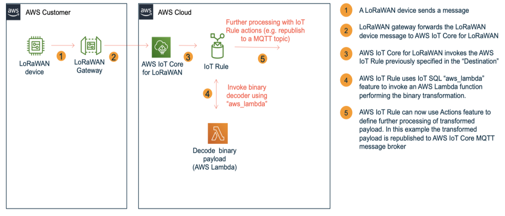

# AWS IoT Core for LoRaWAN - transform a binary LoRaWAN payload into JSON

LoRaWAN devices often encode transmitted data in a binary format, as it increases transmission efficiency and improves battery lifetime. However, as the data arrive in the cloud, many use cases require a structured format. Transforming the binary data into JSON, for example, enables filtering and enrichment using [AWS IoT SQL](https://docs.aws.amazon.com/iot/latest/developerguide/iot-sql-reference.html) as well as acting on the data using [AWS IoT Rule Actions](https://docs.aws.amazon.com/iot/latest/developerguide/iot-rule-actions.html).

This repository contains resources to quickly onboard included LoRaWAN devices or learn how to build your own binary payloads in Python or Node.js.  These resources include:

- Examples of binary decoders for a set of devices. These examples are in Python 3 or Node.js and will be deployed in an [AWS Lambda layer](https://docs.aws.amazon.com/lambda/latest/dg/configuration-layers.html). Following devices are included:
  - Decoder simulating a temperature and humidity sensor device. It enables you to test this sample without need for a physical LoRaWAN device. You can also use it as a boilerplate to developer your own decoder.
  - Browan Tabs Object Locator
  - Dragino LHT65, LGT92, LSE01, LBT1, LDS01
  - Axioma W1
  - Elsys
  - Globalsat LT-100
  - NAS Pulse Reader UM3080

- AWS Lambda functions in [Python 3](transform_binary_payload/src-iotrule-transformation) and [Node.js](transform_binary_payload/src-iotrule-transformation-node) that will be invoked by the AWS IoT Rule to perform binary decoding

- [AWS IoT Rules](#example-for-transforming-a-lorawan-binary-payload) that will be neccessary to integrate the binary decoding with AWS IoT Core for LoRaWAN (please see [documentation](https://docs.aws.amazon.com/iot/latest/developerguide/connect-iot-lorawan-destination-rules.html) for details). In this sample, the IoT Rule uses a [republish action](https://docs.aws.amazon.com/iot/latest/developerguide/republish-rule-action.html) to republish transformed payload to another MQTT topic. You can use more than 20 other [AWS IoT Rule actions](https://docs.aws.amazon.com/iot/latest/developerguide/iot-rule-actions.html) to adjust the rule for the requirements of your use case. This sample includes two IoT Rules: one for invocation of Python 3 decoders, another one for invocation of Node.js decoders.

## Quick start
You can quickly test this sample by [deploying the before mentioned resources using AWS SAM](#step-1-check-prerequisites). If you prefer to build your own binary transformation decoder for a LoRaWAN device, please follow this [step-by-step guidance](#how-to-build-and-deploy-a-binary-decoder-for-your-lorawan-device).

## Solution Architecture

A picture bellow illustrates an architecture in this sample:



By executing a stack in a CloudFormation template the following resources will be deployed in your AWS account:

1. AWS Lambda layer `samplebinarytransform-LoRaWANPayloadDecoderLayer...` containing the binary decoder logic. You can review the source code for binary decoders [here (Python 3)](transform_binary_payload/src-payload-decoders/python) and [here (node.js)](transform_binary_payload/src-payload-decoders/node).
2. Two AWS Lambda functions `samplebinarytransform-TransformLoRaWANBinaryPayloadFunctionPython...` and `samplebinarytransform-TransformLoRaWANBinaryPayloadFunctionNode...` that will invoke the binary decoder for your device. You can review the source code for Lambda functions [here (Python 3)](transform_binary_payload/src-iotrule-transformation) and [here (node.js)](transform_binary_payload/src-iotrule-transformation-nodejs).

3. Two AWS IoT Rules `samplebinarytransform_TransformLoRaWANBinaryPayloadPython_...` and `samplebinarytransform_TransformLoRaWANBinaryPayloadNode_...` with the necessary IAM roles and policies to perform rule actions. You can review the IoT SQL query statement for the rules [here](transform_binary_payload/template.yaml).
  
The names above assume that `samplebinarytransform` will be the stack name you choose. A name of a binary decoder will be appended to the name of the AWS IoT Rule.

## Choose an approach for using this sample

Before you proceed, please select a preferred approach for using this sample:

- If you don't have a LoRaWAN device yet, or your LoRaWAN device is not included in a list below, please proceed to [Approach A: using simulated decoder](#approach-a-using-simulated-decoder). You will learn how to use binary decoding based on a decoder for a simulated device.
- If your device is included in the list below, please proceed to [Approach B](#approach-b-using-lorawan-device-with-an-included-decoder). You will get guidelines on how to deploy a binary decoder for your device.

Example binary decoders for the following devices are included in this sample:

| Manufacturer | Device              | Decoder name       | Python 3 | Node.js |
| ------------ | ------------------- | ------------------ | -------- | ------- |
| Browan       | Tabs Object Locator | tabs_objectlocator | x        |         |
| Axioma       | W1                  | axioma_w1          | x        |         |
| Dragino      | LHT65               | dragino_lht65      | x        | x       |
| Dragino      | LGT92               | dragino_lgt92      | x        |         |
| Dragino      | LSE01               | dragino_lse01      | x        |         |
| Dragino      | LBT1                | dragino_lbt1       | x        |         |
| Dragino      | LDS01               | dragino_lds01      | x        |         |
| Elsys        | all                 | elsys              | x        |         |
| Globalsat    | LT-100              | globalsat_lt100    | x        |         |
| NAS          | Pulse Reader UM3080 | nas_um3080         | x        |         |


## Approach A: using simulated decoder

### Step 1: Check prerequisites

- The sample requires AWS SAM CLI, you can find installation instructions [here](https://docs.aws.amazon.com/serverless-application-model/latest/developerguide/serverless-sam-cli-install.html). If you use [AWS CloudShell](https://aws.amazon.com/cloudshell/) or [AWS Cloud9](https://aws.amazon.com/cloud9/), SAM is already preinstalled.
- If you plan to deploy an example for Node.js decoder, please ensure that Node.js 12.x is installed. Otherwise please disable the deployment of Node.js examples.
  
### Step 2: Deploy the sample for a simulated decoder in your AWS account

Please perform the following steps to deploy a sample application:

1. Check out this repository on your computer

    ```shell
    git clone https://github.com/aws-samples/aws-iot-core-lorawan 
    cd aws-iot-core-lorawan/integration/transform_binary_payload
    ```

2. Perform the following command to build the SAM artifacts:

   ```shell
   sam build
   ```

3. Deploy the SAM template to your AWS account.

   ```shell
   sam deploy --guided --stack-name samplebinarytransform
   ```

    Please select the default values of parameters by typing "Enter", with the following exceptions:
    - **AWS Region:** select a region supporting AWS IoT Core for LoRaWAN
    - **EnableNodeJSSupport**: please select **false** if you don't want to deploy the Node.JS examples for binary decoding.
    - **EnablePythonSupport**: please select **false** if you don't want to deploy the Python examples for binary decoding.
    
    Please note that `sam deploy --guided` should be only executed for a first deployment. To redeploy after that please use `sam deploy`.

4. Please wait few minutes to complete the deployment

    ```bash
    Successfully created/updated stack - samplebinarytransform in <region>
    ```


### Step 3: Testing binary transformation by simulating an ingestion from a LoRaWAN device

1. Please open the MQTT Test Client in AWS Management console by using [this link](https://console.aws.amazon.com/iot/home?#/test). Please ensure to use the same AWS region that you selected in `sam --deploy-guided` command.
2. Please subscribe to the topic `lorawantransformed`
3. Please publish the payload as specified below to the MQTT topic `$aws/rules/samplebinarytransform_TransformLoRaWANBinaryPayloadPython_sample_device`. 

    ```json
    {
        "PayloadData": "y7QKRAGpAQnEf/8=",
        "WirelessDeviceId": "57728ff8-5d1d-4130-9de2-f004d8722bc2",
        "WirelessMetadata": {
          "LoRaWAN": {
            "DataRate": 0,
            "DevEui": "a84041d55182720b",
            "FPort": 2,
            "Frequency": 867900000,
            "Gateways": [
              {
                "GatewayEui": "dca632fffe45b3c0",
                "Rssi": -76,
                "Snr": 9.75
              }
            ],
            "Timestamp": "2020-12-07T14:41:48Z"
          }
        } 
    }
    ```

4. Please review the messages on the topic `lorawantransformed`
  
    The expected output on the topic `lorawantransformed` should be:

    ```json
    {
      "transformed_payload": {
        "input_length": 11,
        "input_hex": "CBB60ACB016D010A347FFF",
        "status": 200,
        "WirelessDeviceId": "57728ff8-5d1d-4130-9de2-f004d8722bc2",
        "DevEui": "a84041d55182720b"
      },
      "lns_payload": {
        "WirelessDeviceId": "57728ff8-5d1d-4130-9de2-f004d8722bc2",
        "WirelessMetadata": {
          "LoRaWAN": {
            "DataRate": 0,
            "DevEui": "a84041d55182720b",
            "FPort": 2,
            "Frequency": 867900000,
            "Gateways": [
              {
                "GatewayEui": "dca632fffe45b3c0",
                "Rssi": -76,
                "Snr": 9.75
              }
            ],
            "Timestamp": "2020-12-07T14:41:48Z"
          }
        },
        "PayloadData": "y7QKRAGpAQnEf/8="
      },
      "timestamp": 1607352177425
    }
    ```

The "transformed_payload" part of the message contains artificialy created decoded payload data according to the instructions in the binary decoder you can find in `src-payload-decoders/python/sample_device.py`:
```python
    result = {
        "temperature": temperature,
        "humidity": humidity
    }
```

## Step 4: Integrating with AWS IoT Core for LoRaWAN

After a successful deployment of the AWS CloudFormation stack, you should configure AWS IoT Core for LoRaWAN to invoke AWS IoT Rule `samplebinarytransform_TransformLoRaWANBinaryPayloadPython_sample_device` each time AWS IoT Core receives a message from a LoRaWAN device:

1. Open "IoT Core" in an AWS management console
2. Click on "Wireless connectivity"
3. Click on "Destinations"
4. Click on "Add destination"
5. Configure the new destination:
   - IAM Role : if you have not created the IAM role for invocation of AWS IoT Rule yet, please click [here for guidelines](#how-to-create-an-iam-role-for-aws-iot-core-for-lorawan-destination)
   - DestinationName: for example `SampleDeviceDestination`
   - RuleName: please input `samplebinarytransform_TransformLoRaWANBinaryPayloadPython_sample_device`

6. Click on "Add destination" button at the bottom of the page
7. Please assign the newly created destination `SampleDeviceDestination` to your LoRaWAN device:  
     - If you create a new LoRaWAN device in AWS IoT Core for LoRaWAN, you should specify `SampleDeviceDestination` as a destination
     - If you already have created a LoRaWAN devices, please use the "Edit" function of the console to update the Destination of the device

## Step 5: Verify the invocation of the AWS IoT Rule 

The following description assumes that you already configured and tested your LoRaWAN Device and LoRaWAN gateway in AWS IoT Core for LoRaWAN. To learn how to do this, please consult [AWS IoT Core for LoRaWAN developer guide](https://docs.aws.amazon.com/iot/latest/developerguide/connect-iot-lorawan.html#connect-iot-lorawan-getting-started-overview).

To verify the invocation of the AWS IoT Rule, please follow these steps:
1. Open "IoT Core" in an AWS management console
2. Click on "Test" to open a MQTT client 
3. Click on "Subscribe to topic"
4. Add `lorawantransformed` and click on "Subscribe"
5. Click on "Subscribe to topic"
6. Add `lorawanerror` and click on "Subscribe"
7. Trigger or wait for the ingestion for your LoRaWAN device connected to AWS IoT Core for LoRaWAN
6. After LoRaWAN device ingestion, you should see a payload like this on `lorawantransformed` topic:
```json
{
  "transformed_payload": {
    "input_length": 11,
    "input_hex": "CBB40A830140010A347FFF",
    "status": 200,
    "WirelessDeviceId": "57728ff8-5d1d-4130-9de2-f004d8722bc2",
    "DevEui": "a84041d55182720b"
  },
  "lns_payload": {
    "WirelessDeviceId": "57728ff8-5d1d-4130-9de2-f004d8722bc2",
    "WirelessMetadata": {
      "LoRaWAN": {
        "DataRate": 0,
        "DevEui": "a84041d55182720b",
        "FPort": 2,
        "Frequency": 867900000,
        "Gateways": [
          {
            "GatewayEui": "dca632fffe45b3c0",
            "Rssi": -89,
            "Snr": 8.25
          }
        ],
        "Timestamp": "2020-12-07T15:27:28Z"
      }
    },
    "PayloadData": "y7QKgwFAAQo0f/8="
  },
  "timestamp": 1607354848824
}
```

Congratulations! You successfully implemented and tested binary decoding for AWS IoT Core for LoRaWAN.

Now you can configure the processing of the decoded data by adding further actions to the AWS IoT Rule `samplebinarytransform_TransformLoRaWANBinaryPayloadPython_sample_device`, for example actions to:

- Store the data in Amazon Timestream, DynamoDB or S3
- Send a message as an input to AWS IoT Events
- Send a message to AWS IoT analytics

After you have completed working with this sample, you can proceed to [Cleaning up](#step-6-cleaning-up) section.


## Approach B: using LoRaWAN device with an included decoder

### Step 1: Check prerequisites

- The sample requires AWS SAM CLI, you can find installation instructions [here](https://docs.aws.amazon.com/serverless-application-model/latest/developerguide/serverless-sam-cli-install.html). If you use [AWS CloudShell](https://aws.amazon.com/cloudshell/) or [AWS Cloud9](https://aws.amazon.com/cloud9/), SAM is already preinstalled.
- If you plan to deploy an example for Node.js decoder, please ensure that Node.js 12.x is installed. Otherwise please disable the deployment of Node.js examples.

### Step 2: Deploy the sample 

**Note:** The sample requires AWS SAM CLI, you can find installation instructions [here](https://docs.aws.amazon.com/serverless-application-model/latest/developerguide/serverless-sam-cli-install.html). If you use [AWS CloudShell](https://aws.amazon.com/cloudshell/) or [AWS Cloud9](https://aws.amazon.com/cloud9/), SAM is already preinstalled.

Please perform the following steps to deploy a sample application:

1. Check out this repository on your computer

    ```shell
    git clone https://github.com/aws-samples/aws-iot-core-lorawan 
    cd aws-iot-core-lorawan/transform_binary_payload
    ```

2. Perform the following command to build the SAM artifacts:

   ```shell
   sam build
   ```

3. Deploy the SAM template to your AWS account.

   ```shell
   sam deploy --guided --stack-name samplebinarytransform
   ```

    Please select the default values of parameters by typing "Enter", with the following exceptions:
    - Parameter **AWS Region:** select a region supporting AWS IoT Core for LoRaWAN
    - Parameter **ParamBinaryDecoderName**: select a decoder name according to a following overview:
  
      | Manufacturer | Device              | Decoder name       | Python 3 | Node.js |
      | ------------ | ------------------- | ------------------ | -------- | ------- |
      | Browan       | Tabs Object Locator | tabs_objectlocator | x        |         |
      | Axioma       | W1                  | axioma_w1          | x        |         |
      | Dragino      | LHT65               | dragino_lht65      | x        | x       |
      | Dragino      | LGT92               | dragino_lgt92      | x        |         |
      | Dragino      | LSE01               | dragino_lse01      | x        |         |
      | Dragino      | LBT1                | dragino_lbt1       | x        |         |
      | Dragino      | LDS01               | dragino_lds01      | x        |         |
      | Elsys        | all                 | elsys              | x        |         |
      | Globalsat    | LT-100              | globalsat_lt100    | x        |         |
      | NAS          | Pulse Reader UM3080 | nas_um3080         | x        |         |
    

    Please note that `sam deploy --guided` should be only executed for a first deployment. To redeploy after that please use `sam deploy`.

4. Please wait few minutes to complete the deployment

    ```bash
    Successfully created/updated stack - samplebinarytransform in <region>
    ```

### Step 3: Testing binary transformation by simulating an ingestion from a LoRaWAN device

1. Please open the MQTT Test Client in AWS Management console by using [this link](https://console.aws.amazon.com/iot/home?#/test). Please ensure to use the same AWS region that you selected in `sam --deploy-guided` command.
2. Please subscribe to the topic `lorawantransformed`
3. Select the right topic name:
    - If you want to invoke a Python decoder, please use topic `$aws/rules/samplebinarytransform_TransformLoRaWANBinaryPayloadPython_<Decoder name>`
    - If you want to invoke a Node.js decoder, please use topic `$aws/rules/samplebinarytransform_TransformLoRaWANBinaryPayloadNose_<Decoder name>`

    Please replace \<Decoder name> in the topic name with a value of the column "Decoder name" from the table above, e.g. samplebinarytransform_TransformLoRaWANBinaryPayload_axioma_w1.
    
4. Select the example payload

    First please use the table below to identify an appropriate PayloadData (this is Base64-payload example as it would be ingsted by your LoRaWAN device):
          
    | Manufacturer | Device name         | Sample "PayloadData"                                              |
    | ------------ | ------------------- | ----------------------------------------------------------------- |
    | Axioma       | W1                  | eoFaXxADAAAAwKRZXwMAAAAAAAAAAAAAAAAAAAAAAAAAAAAAAAAAAAAAAAAAAAA=  |
    | Dragino      | LHT65               | y6QHxgG4AQhmf/8=                                                  |
    | Dragino      | LSE01               | AuHtlACmawQPVGM=                                                  |
    | Dragino      | LGT92               | DSEAAAEVCMUGpAA=                                                  |
    | Dragino      | LBT1                | DxwAAAIDQUJCQ0NEREVFRkYwMjcxMjFGNkFDMy0wNTk=                      |
    | Browan       | Tabs Object Locator | Ae48SPbhAgRupmA=                                                  |
    | Elsys        | all                 | MDEwMEUyMDIyOTA0MDAyNzA1MDYwNjAzMDgwNzBENjIxOTAwRTIxOTAwQTM=      |
    | Globalsat    | LT-100              | MDA4MjY0MDI2NERBRDlGQjg4RENENg==                                  |
    | NAS          | Pulse Reader UM3080 | (fPort 24) NDNGNjFBNEIxMjAxMDAwMDAwMjBDNDA5MDAwMA==               |
    | NAS          | Pulse Reader UM3080 | (fPort 25) MDMxMjAxMDAwMDAwMTAwMDAwMDAwMA==                       |
    | NAS          | Pulse Reader UM3080 | (fPort 99, boot) MDBDNzAxMTY0QzAwMDcwODEwMDI=                     |
    | NAS          | Pulse Reader UM3080 | (fPort 99, shutdown) MDEzMTQzRjYxQTRCMTIwMTAwMDAwMDIwQzQwOTAwMDA= |

    The payload is structured in a same way as it will be ingested by AWS IoT Core for LoRaWAN. Please replace the `<Sample PayloadData>` with the value of "Sample PayloadData>" from the following table:

    In a next step, please insert selected sample PayloadData in the example message below:

    ```json
    {
        "PayloadData": "<Sample PayloadData>",
        "WirelessDeviceId": "57728ff8-5d1d-4130-9de2-f004d8722bc2",
        "WirelessMetadata": {
          "LoRaWAN": {
            "DataRate": 0,
            "DevEui": "a84041d55182720b",
            "FPort": 2,
            "Frequency": 867900000,
            "Gateways": [
              {
                "GatewayEui": "dca632fffe45b3c0",
                "Rssi": -76,
                "Snr": 9.75
              }
            ],
            "Timestamp": "2020-12-07T14:41:48Z"
          }
        } 
    }
    ```

5. Please send the message you have defined in step 4. to the topic you have defined in step 3.
  
6. Please review the messages arriving on the topic `lorawantransformed`
  
    The expected output on the topic `lorawantransformed` should be:


    ```json
    {
      "transformed_payload": {
        ...
        values depending on your LoRaWAN device
        ...
        "WirelessDeviceId": "57728ff8-5d1d-4130-9de2-f004d8722bc2",
        "DevEui": "a84041d55182720b"
      },
      "lns_payload": {
        "WirelessDeviceId": "57728ff8-5d1d-4130-9de2-f004d8722bc2",
        "WirelessMetadata": {
          "LoRaWAN": {
            "DataRate": 0,
            "DevEui": "a84041d55182720b",
            "FPort": 2,
            "Frequency": 867900000,
            "Gateways": [
              {
                "GatewayEui": "dca632fffe45b3c0",
                "Rssi": -76,
                "Snr": 9.75
              }
            ],
            "Timestamp": "2020-12-07T14:41:48Z"
          }
        },
        "PayloadData": "y7QKRAGpAQnEf/8="
      },
      "timestamp": 1607352177425
    }
    ```

### Step 4: Integrating with AWS IoT Core for LoRaWAN

After a successful deployment of the AWS CloudFormation stack, you should configure AWS IoT Core for LoRaWAN to invoke AWS IoT Rule `samplebinarytransform_TransformLoRaWANBinaryPayloadPython_<Decoder name>` or `samplebinarytransform_TransformLoRaWANBinaryPayloadNode_<Decoder name>` each time a LoRaWAN device is ingesting data:

1. Click [here](https://console.aws.amazon.com/iot/home?#/wireless/destinations) to open AWS Management console on the right view. Alternatively you can navigate to IoT Core, Wireless Connectivity, Destinations.
2. Click on "Add destination"
3. Configure the new destination:
   - IAM Role : if you have not created the IAM role for invocation of AWS IoT Rule yet, please click [here for guidelines](#how-to-create-an-iam-role-for-aws-iot-core-for-lorawan-destination)
   - Destination Name: for example `SampleDeviceDestination`
   - Enrer a rule name: please input `samplebinarytransform_TransformLoRaWANBinaryPayloadForPython_<Decoder name>` or `samplebinarytransform_TransformLoRaWANBinaryPayloadForNode_<Decoder name>`

4. Click on "Add destination" button at the bottom of the page
5. Please assign the newly created destination `SampleDeviceDestination` to your LoRaWAN device:  
     - If you create a new LoRaWAN device in AWS IoT Core for LoRaWAN, you should specify `SampleDeviceDestination` as a destination
     - If you already have created a LoRaWAN devices, please use the "Edit" function of the console to update the Destination of the device

## Step 5: Verify the invocation of the AWS IoT Rule on ingestion from a LoRaWAN device

The following description assumes that you already configured and tested your LoRaWAN Device and LoRaWAN gateway in AWS IoT Core for LoRaWAN. To learn how to do this, please consult [AWS IoT Core for LoRaWAN developer guide](https://docs.aws.amazon.com/iot/latest/developerguide/connect-iot-lorawan.html#connect-iot-lorawan-getting-started-overview).

To verify the invocation of the AWS IoT Rule, please follow these steps:
1. Open "IoT Core" in an AWS management console
2. Click on "Test" to open a MQTT client 
3. Click on "Subscribe to topic"
4. Add `lorawantransformed` and click on "Subscribe"
5. Click on "Subscribe to topic"
6. Add `lorawanerror` and click on "Subscribe"
7. Trigger or wait for the ingestion for your LoRaWAN device connected to AWS IoT Core for LoRaWAN
6. After LoRaWAN device ingestion, you should see a payload like this on `lorawantransformed` topic:
   
```json
{
  "transformed_payload": {
    ...
    values depending on your LoRaWAN device
    ...
    "status": 200,
    "WirelessDeviceId": "57728ff8-5d1d-4130-9de2-f004d8722bc2",
    "DevEui": "a84041d55182720b"
  },
  "lns_payload": {
    "WirelessDeviceId": "57728ff8-5d1d-4130-9de2-f004d8722bc2",
    "WirelessMetadata": {
      "LoRaWAN": {
        "DataRate": 0,
        "DevEui": "a84041d55182720b",
        "FPort": 2,
        "Frequency": 867900000,
        "Gateways": [
          {
            "GatewayEui": "dca632fffe45b3c0",
            "Rssi": -89,
            "Snr": 8.25
          }
        ],
        "Timestamp": "2020-12-07T15:27:28Z"
      }
    },
    "PayloadData": "y7QKgwFAAQo0f/8="
  },
  "timestamp": 1607354848824
}
```

Congratulations! You successfully implemented and tested binary decoding for AWS IoT Core for LoRaWAN.

Now you can configure the processing of the decoded data by adding further actions to the AWS IoT Rules, for example actions to:

- Store the data in Amazon Timestream, DynamoDB or S3
- Send a message as an input to AWS IoT Events  
- Send a message to AWS IoT analytics  

## Step 5: Cleaning up

Please open AWS CloudFormation console, select the stack and click on "Delete"

## How to build and deploy a binary decoder for your LoRaWAN device

### Prerequisites

- Install the AWS CLI
- Install the AWS SAM CLI

### Implementation steps

Please perform following steps to implement your own binary transformation model:

1. Check out this repository on your computer

    ```shell
    git clone https://github.com/aws-samples/aws-iot-core-lorawan 
    cd aws-iot-core-lorawan/transform_binary_payload
    ```

2. Review source code of binary transformation for example in [src-payload-decoders/python/sample_device.py](src-payload-decoders/python/sample_device.py) or other decoders available [src-payload-decoders/python](src-payload-decoders/python) . Create a copy of the example, e.g.

    ```shell
    cp src-payload-decoders/sample_device.py src-payload-decoders/python/mymanufacturer_mydevice.py
    ```
  
3. Implement decoding logic in `src-payload-decoders/python/mymanufacturer_mydevice.py`

   Please consider the following guidelines when implementing your binary decoder:
    - Please ensure to keep the name and signature of dict_from_payload function stable and not to modify it. 
    - In case of a failure in decoding, please raise an exception.
    - In case of successfull decoding, please return a JSON object with decoded key/value pairs

    The following example illustrates these guideines:
    ```python
    def dict_from_payload(base64_input: str, fport: int = None):
      # Your code
      if (error): 
        raise Exception("Error description")
      return {"key1":42, "key2": "43"}
    ```
 
4. Edit `src-iotrule-transformation/app.py` and
    1. Add `import mymanufacturer_mydevice.py` 
    2. Add "mymanufacturer_mydevice" value to VALID_PAYLOAD_DECODER_NAMES

5. This sample uses AWS SAM to build and deploy all necessary resources (e.g. AWS Lambda function, AWS IoT Rule, AWS IAM Roles) to your AWS account. Please perform the following commands to build the SAM artifacts:

   ```shell
   sam build
   ```

   As a results, the artifacts for the deployment will be placed in a an `.aws-sam` directory.

6. Deploy the SAM template to your AWS account.

   ```shell
   sam deploy --guided --stack-name samplebinarytransform
   ```

    Please note that `sam deploy --guided --stack-name samplebinarytransform` should be only executed for a first deployment. To redeploy after that please use `sam deploy`.


    Congratulations! You successfully deployed your binary transformation logic into your AWS account. Please follow [this guidelines](#step-4-integrating-with-aws-iot-core-for-lorawan) to integrate with AWS IoT Core for LoRaWAN


## How to create an IAM role for AWS IoT Core for LoRaWAN destination

Please use AWS IAM to add an IAM role with the following configuration:

**Trust relationship**  

```json
{
  "Version": "2012-10-17",
  "Statement": [
    {
      "Effect": "Allow",
      "Principal": {
        "Service": [
          "iotwireless.amazonaws.com"
        ]
      },
      "Action": "sts:AssumeRole"
    }
  ]
}
```

**Permissions**  
Role permissions will depend on your use-cases, however they should at least contain the permission to publish to an IoT topic:

```json
{
    "Version": "2012-10-17",
    "Statement": [
        {
            "Sid": "VisualEditor0",
            "Effect": "Allow",
            "Action": [
                "iot:Publish"
            ],
            "Resource": [
                "arn:aws:iot:us-east-1:<your account id>:topic/*"
            ]
        }
    ]
}
```

Please adjust the policy according to your use case following a least privilege principle.
