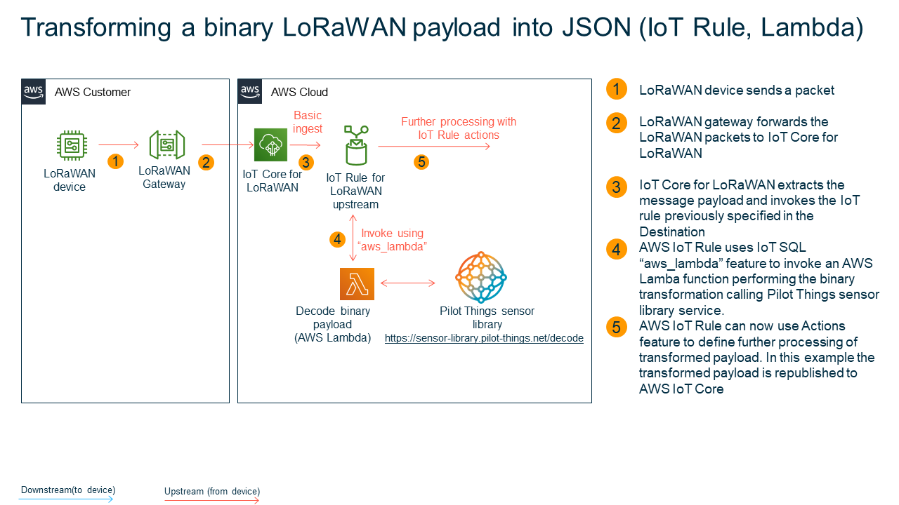

# AWS IoT Core for LoRaWAN - deployable reference architecture for binary decoding with Pilot Things Sensor Library

LoRaWAN devices encode transmitted data in a binary format, as it increases transmission efficiency and improves battery lifetime. However, as the data arrive in the cloud, many use cases require a structured format. Transforming the binary data into JSON, for example, enables filtering and enrichment using [AWS IoT SQL](https://docs.aws.amazon.com/iot/latest/developerguide/iot-sql-reference.html) as well as acting on the data using [AWS IoT Rule Actions](https://docs.aws.amazon.com/iot/latest/developerguide/iot-rule-actions.html).

This repository can help you to accelerate development of your LoRaWAN-based IoT solutions by providing a deployable reference architecture which will decode binary data using the Pilot Things Sensor Library.

The Pilot Things Sensor Library is a SaaS offering that can be [purchased from the AWS marketplace](https://aws.amazon.com/marketplace/pp/B08W5BCWT5)

## Introduction
This repository contains resources to quickly onboard [supported LoRaWAN devices](https://www.pilot-things.com/smart-platform/sensor-library).  These resources include:

- AWS Lambda functions in [Python 3](transform_binary_payload_pilot_things/src-iotrule-transformation) and [Node.js](transform_binary_payload_pilot_things/src-iotrule-transformation-node) that will be invoked by the AWS IoT Rule to call the Pilot Things Sensor Library to perform binary decoding

- [AWS IoT Rules](#example-for-transforming-a-lorawan-binary-payload) that will be necessary to integrate the binary decoding with AWS IoT Core for LoRaWAN (please see [documentation](https://docs.aws.amazon.com/iot/latest/developerguide/connect-iot-lorawan-destination-rules.html) for details). In this sample, the IoT Rule uses a [republish action](https://docs.aws.amazon.com/iot/latest/developerguide/republish-rule-action.html) to republish transformed payload to another MQTT topic. You can use more than 20 other [AWS IoT Rule actions](https://docs.aws.amazon.com/iot/latest/developerguide/iot-rule-actions.html) to adjust the rule for the requirements of your use case. This sample includes two IoT Rules: one for invocation of the Python 3 lambda, another one for invocation of the Node.js lambda.

## Quick start
You can quickly test this sample by [deploying the before mentioned resources using AWS SAM](#step-1-check-prerequisites).

## Solution Architecture

A picture bellow illustrates an architecture in this sample:



By executing a stack in a CloudFormation template the following resources will be deployed in your AWS account:

1. Two AWS Lambda functions `samplebinarytransform-TransformLoRaWANBinaryPayloadUsingPilotThingsFunctionPython...` and `samplebinarytransform-TransformLoRaWANBinaryPayloadUsingPilotThingsFunctionNode...` that will invoke the binary decoder for your device. You can review the source code for Lambda functions [here (Python 3)](transform_binary_payload_pilot_things/src-iotrule-transformation) and [here (node.js)](transform_binary_payload_pilot_things/src-iotrule-transformation-nodejs).

2. Two AWS IoT Rules `samplebinarytransform_TransformLoRaWANBinaryPayloadUsingPilotThingsPython_...` and `samplebinarytransform_TransformLoRaWANBinaryPayloadUsingPilotThingsNode_...` with the necessary IAM roles and policies to perform rule actions. You can review the IoT SQL query statement for the rules [here](transform_binary_payload_pilot_things/template.yaml).
  
The names above assume that `samplebinarytransform` will be the stack name you choose. The GUID of a product will be appended to the name of the AWS IoT Rule.

## Choose an approach for using this sample

Before you proceed, please select a preferred approach for using this sample:

- If you don't have a LoRaWAN device yet, or your LoRaWAN device is not included in [the list of supported devices](https://www.pilot-things.com/smart-platform/sensor-library), please proceed to [Approach A: using simulated data](#approach-a-using-simulated-data). You will learn how to use binary decoding based on a sample data from a real device. Or please [contact us](https://www.pilot-things.com/company/contact) if you'd like your LoRaWAN device to be added to the list of compatible devices.
- If your device is included in [the list of supported devices](https://www.pilot-things.com/smart-platform/sensor-library), please proceed to [Approach B](#approach-b-using-lorawan-device-with-a-supported-decoder). You will get guidelines on how to deploy a binary decoder for your device.


## Approach A: using simulated data

### Step 1: Check prerequisites

- The sample requires AWS SAM CLI, you can find installation instructions [here](https://docs.aws.amazon.com/serverless-application-model/latest/developerguide/serverless-sam-cli-install.html). If you use [AWS CloudShell](https://aws.amazon.com/cloudshell/) or [AWS Cloud9](https://aws.amazon.com/cloud9/), SAM is already preinstalled.
- If you plan to deploy an example for Node.js decoder, please ensure that Node.js 12.x is installed. Otherwise, please disable the deployment of Node.js examples.
  
### Step 2: Deploy the sample for a simulated decoder in your AWS account

Please perform the following steps to deploy a sample application:

1. Clone this repository on your workstation

    ```shell
    git clone https://github.com/aws-samples/aws-iot-core-lorawan 
    cd aws-iot-core-lorawan/transform_binary_payload_pilot_things
    ```

2. Perform the following command to build the SAM artifacts:

   ```shell
   sam build
   ```

3. Deploy the SAM template to your AWS account.

   ```shell
   sam deploy --guided --stack-name samplebinarytransform
   ```

    Please select the default values of parameters by typing "Enter", with the following exceptions:
    - **AWS Region**: select a region supporting AWS IoT Core for LoRaWAN
    - **ParamServiceApiKey**: enter the API key you received after subscribing to the Sensor library service.
    - **ParamGuidProductId**: enter `69714577-5c18-4931-866a-1026b55c603d`.
    - **EnableNodeJSSupport**: please select **false** if you don't want to deploy the Node.JS examples for binary decoding.
    - **EnablePythonSupport**: please select **false** if you don't want to deploy the Python examples for binary decoding.
    
    Please note that `sam deploy --guided` should be only executed for a first deployment. To redeploy after that please use `sam deploy`.

4. Please wait few minutes to complete the deployment

    ```bash
    Successfully created/updated stack - samplebinarytransform in <region>
    ```


### Step 3: Testing binary transformation by simulating an ingestion from a LoRaWAN device

1. Please open the MQTT Test Client in AWS Management console by using [this link](https://console.aws.amazon.com/iot/home?#/test). Please ensure to use the same AWS region that you selected in `sam --deploy-guided` command.
2. Please subscribe to the topic `lorawantransformed`
3. Please publish the payload as specified below to the MQTT topic `$aws/rules/samplebinarytransform_TransformLoRaWANBinaryPayloadUsingPilotThingsPython_69714577_5c18_4931_866a_1026b55c603d`. 

    ```json
    {
      "PayloadData": "F2XUdQ4=",
      "WirelessDeviceId": "57728ff8-5d1d-4130-9de2-f004d8722bc2",
      "WirelessMetadata": {
        "LoRaWAN": {
          "DataRate": 0,
          "DevEui": "a84041d55182720b",
          "FPort": 2,
          "Frequency": 867900000,
          "Gateways": [
            {
              "GatewayEui": "dca632fffe45b3c0",
              "Rssi": -76,
              "Snr": 9.75
            }
          ],
          "Timestamp": "2020-12-07T14:41:48Z"
        }
      } 
    }
    ```

4. Please review the messages on the topic `lorawantransformed`
  
    The expected output on the topic `lorawantransformed` should be:

    ```json
    {
      "transformed_payload": {
        "temperature": 23.05,
        "humidity": 51.16,
        "status": 200,
        "product_id": "69714577-5c18-4931-866a-1026b55c603d",
        "WirelessDeviceId": "57728ff8-5d1d-4130-9de2-f004d8722bc2",
        "DevEui": "a84041d55182720b"
      },
      "lns_payload": {
        "WirelessDeviceId": "57728ff8-5d1d-4130-9de2-f004d8722bc2",
        "WirelessMetadata": {
          "LoRaWAN": {
            "DataRate": 0,
            "DevEui": "a84041d55182720b",
            "FPort": 2,
            "Frequency": 867900000,
            "Gateways": [
              {
                "GatewayEui": "dca632fffe45b3c0",
                "Rssi": -76,
                "Snr": 9.75
              }
            ],
            "Timestamp": "2020-12-07T14:41:48Z"
          }
        },
        "PayloadData": "F2XUdQ4="
      },
      "timestamp": 1622413425499
    }
    ```

The "transformed_payload" part of the message contains decoded payload data from the sample binary payload.

Congratulations! You successfully implemented and tested binary decoding for AWS IoT Core for LoRaWAN.

After you have completed working with this sample, you can proceed to [Cleaning up](#step-6-cleaning-up) section.


## Approach B: using LoRaWAN device with a supported decoder

### Step 1: Check prerequisites

- The sample requires AWS SAM CLI, you can find installation instructions [here](https://docs.aws.amazon.com/serverless-application-model/latest/developerguide/serverless-sam-cli-install.html). If you use [AWS CloudShell](https://aws.amazon.com/cloudshell/) or [AWS Cloud9](https://aws.amazon.com/cloud9/), SAM is already preinstalled.
- If you plan to deploy an example for Node.js decoder, please ensure that Node.js 12.x is installed. Otherwise please disable the deployment of Node.js examples.

### Step 2: Deploy the sample

Please perform the following steps to deploy a sample application:

1. Clone this repository on your workstation

    ```shell
    git clone https://github.com/aws-samples/aws-iot-core-lorawan 
    cd aws-iot-core-lorawan/transform_binary_payload_pilot_things
    ```

2. Perform the following command to build the SAM artifacts:

   ```shell
   sam build
   ```

3. Deploy the SAM template to your AWS account.

   ```shell
   sam deploy --guided --stack-name samplebinarytransform
   ```

    Please select the default values of parameters by typing "Enter", with the following exceptions:
    - **AWS Region**: select a region supporting AWS IoT Core for LoRaWAN
    - **ParamServiceApiKey**: enter the API key you received after subscribing to the Sensor library service.
    - **ParamGuidProductId**: one of the GUIDs from the [list of supported devices](https://www.pilot-things.com/smart-platform/sensor-library).

    Please note that `sam deploy --guided` should be only executed for a first deployment. To redeploy after that please use `sam deploy`.

4. Please wait few minutes to complete the deployment

    ```bash
    Successfully created/updated stack - samplebinarytransform in <region>
    ```

### Step 3: Testing binary transformation by simulating an ingestion from a LoRaWAN device

1. Please open the MQTT Test Client in AWS Management console by using [this link](https://console.aws.amazon.com/iot/home?#/test). Please ensure to use the same AWS region that you selected in `sam --deploy-guided` command.
2. Please subscribe to the topic `lorawantransformed`
3. Select the right topic name:
    - If you want to invoke a Python decoder, please use topic `$aws/rules/samplebinarytransform_TransformLoRaWANBinaryPayloadUsingPilotThingsPython_<Product ID>`
    - If you want to invoke a Node.js decoder, please use topic `$aws/rules/samplebinarytransform_TransformLoRaWANBinaryPayloadUsingPilotThingsNode_<Product ID>`

    Please replace \<Product ID> in the topic name with the value you entered for **ParamGuidProductId**, but with dashes replaced for underscores, e.g. samplebinarytransform_TransformLoRaWANBinaryPayloadUsingPilotThingsPython_69714577_5c18_4931_866a_1026b55c603d.
    
4. Select the example payload

    The catalog is too big to give an example payload for every device, so you will have to use an existing payload from your device (Base64-encoded) or skip the testing step.

    The payload is structured in a same way as it will be ingested by AWS IoT Core for LoRaWAN. Please replace `<Sample PayloadData>` with your sample data:

    In a next step, please insert selected sample PayloadData in the example message below:

    ```json
    {
        "PayloadData": "<Sample PayloadData>",
        "WirelessDeviceId": "57728ff8-5d1d-4130-9de2-f004d8722bc2",
        "WirelessMetadata": {
          "LoRaWAN": {
            "DataRate": 0,
            "DevEui": "a84041d55182720b",
            "FPort": 2,
            "Frequency": 867900000,
            "Gateways": [
              {
                "GatewayEui": "dca632fffe45b3c0",
                "Rssi": -76,
                "Snr": 9.75
              }
            ],
            "Timestamp": "2020-12-07T14:41:48Z"
          }
        } 
    }
    ```

5. Please send the message you have defined in step 4. to the topic you have defined in step 3.
  
6. Please review the messages arriving on the topic `lorawantransformed`
  
    The expected output on the topic `lorawantransformed` should be:


    ```json
    {
      "transformed_payload": {
        "status": 200,
        // values depending on your LoRaWAN device go here
        "WirelessDeviceId": "57728ff8-5d1d-4130-9de2-f004d8722bc2",
        "DevEui": "a84041d55182720b"
      },
      "lns_payload": {
        "WirelessDeviceId": "57728ff8-5d1d-4130-9de2-f004d8722bc2",
        "WirelessMetadata": {
          "LoRaWAN": {
            "DataRate": 0,
            "DevEui": "a84041d55182720b",
            "FPort": 2,
            "Frequency": 867900000,
            "Gateways": [
              {
                "GatewayEui": "dca632fffe45b3c0",
                "Rssi": -76,
                "Snr": 9.75
              }
            ],
            "Timestamp": "2020-12-07T14:41:48Z"
          }
        },
        "PayloadData": "<Sample PayloadData>"
      },
      "timestamp": 1607352177425
    }
    ```

### Step 4: Integrating with AWS IoT Core for LoRaWAN

After a successful deployment of the AWS CloudFormation stack, you should configure AWS IoT Core for LoRaWAN to invoke AWS IoT Rule `samplebinarytransform_TransformLoRaWANBinaryPayloadUsingPilotThingsPython_<Product ID>` or `samplebinarytransform_TransformLoRaWANBinaryPayloadUsingPilotThingsNode_<Product ID>` each time a LoRaWAN device is ingesting data:

1. Click [here](https://console.aws.amazon.com/iot/home?#/wireless/destinations) to open AWS Management console on the right view. Alternatively you can navigate to IoT Core, Wireless Connectivity, Destinations.
2. Click on "Add destination"
3. Configure the new destination:
   - IAM Role : if you have not created the IAM role for invocation of AWS IoT Rule yet, please click [here for guidelines](#how-to-create-an-iam-role-for-aws-iot-core-for-lorawan-destination)
   - Destination Name: for example `SampleDeviceDestination`
   - Enrer a rule name: please input `samplebinarytransform_TransformLoRaWANBinaryPayloadUsingPilotThingsPython_<Product ID>` or `samplebinarytransform_TransformLoRaWANBinaryPayloadUsingPilotThingsNode_<Product ID>`

4. Click on "Add destination" button at the bottom of the page
5. Please assign the newly created destination `SampleDeviceDestination` to your LoRaWAN device:  
     - If you create a new LoRaWAN device in AWS IoT Core for LoRaWAN, you should specify `SampleDeviceDestination` as a destination
     - If you already have created a LoRaWAN devices, please use the "Edit" function of the console to update the Destination of the device

## Step 5: Verify the invocation of the AWS IoT Rule on ingestion from a LoRaWAN device

The following description assumes that you already configured and tested your LoRaWAN Device and LoRaWAN gateway in AWS IoT Core for LoRaWAN. To learn how to do this, please consult [AWS IoT Core for LoRaWAN developer guide](https://docs.aws.amazon.com/iot/latest/developerguide/connect-iot-lorawan.html#connect-iot-lorawan-getting-started-overview).

To verify the invocation of the AWS IoT Rule, please follow these steps:
1. Open "IoT Core" in an AWS management console
2. Click on "Test" to open a MQTT client 
3. Click on "Subscribe to topic"
4. Add `lorawantransformed` and click on "Subscribe"
5. Click on "Subscribe to topic"
6. Add `lorawanerror` and click on "Subscribe"
7. Trigger or wait for the ingestion for your LoRaWAN device connected to AWS IoT Core for LoRaWAN
6. After LoRaWAN device ingestion, you should see a payload like this on `lorawantransformed` topic:
   
```json
{
  "transformed_payload": {
    "status": 200,
    // values depending on your LoRaWAN device
    "WirelessDeviceId": "57728ff8-5d1d-4130-9de2-f004d8722bc2",
    "DevEui": "a84041d55182720b"
  },
  "lns_payload": {
    "WirelessDeviceId": "57728ff8-5d1d-4130-9de2-f004d8722bc2",
    "WirelessMetadata": {
      "LoRaWAN": {
        "DataRate": 0,
        "DevEui": "a84041d55182720b",
        "FPort": 2,
        "Frequency": 867900000,
        "Gateways": [
          {
            "GatewayEui": "dca632fffe45b3c0",
            "Rssi": -89,
            "Snr": 8.25
          }
        ],
        "Timestamp": "2020-12-07T15:27:28Z"
      }
    },
    "PayloadData": "<Payload Data>"
  },
  "timestamp": 1607354848824
}
```

Congratulations! You successfully implemented and tested binary decoding for AWS IoT Core for LoRaWAN.

Now you can configure the processing of the decoded data by adding further actions to the AWS IoT Rules, for example actions to:

- Store the data in Amazon Timestream, DynamoDB or S3
- Send a message as an input to AWS IoT Events  
- Send a message to AWS IoT analytics  

## Step 6: Cleaning up

Please open AWS CloudFormation console, select the stack and click on "Delete"

## How to create an IAM role for AWS IoT Core for LoRaWAN destination

Please use AWS IAM to add an IAM role with the following configuration:

**Trust relationship**  

```json
{
  "Version": "2012-10-17",
  "Statement": [
    {
      "Effect": "Allow",
      "Principal": {
        "Service": [
          "iotwireless.amazonaws.com"
        ]
      },
      "Action": "sts:AssumeRole"
    }
  ]
}
```

**Permissions**  
Role permissions will depend on your use-cases, however they should at least contain the permission to publish to an IoT topic:

```json
{
    "Version": "2012-10-17",
    "Statement": [
        {
            "Sid": "VisualEditor0",
            "Effect": "Allow",
            "Action": [
                "iot:Publish"
            ],
            "Resource": [
                "arn:aws:iot:us-east-1:<your account id>:topic/*"
            ]
        }
    ]
}
```

Please adjust the policy according to your use case following a least privilege principle.
